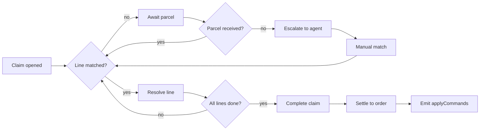

# Spec Reader Demo

A quick showcase of rendering features.

## Mermaid



Click a diagram to open it full screen with zoom and pan.

## Grafiq mockup

```mockup
card "Sign in"
  input label="Email" placeholder="you@example.com"
  input label="Password" type=password
  row gap=8
    checkbox "Remember me" checked
    spacer
    link "Forgot password?"
  row gap=8
    spacer
    button "Cancel"
    button "Sign in" primary
```

Mockups are interactive — click widgets, toggle the source with `</>`, or open
them fullscreen with ⤢.

## Filtrera highlighting

```filtrera
param age = 30

let discount (n) |> n * 25%

from age match
  when age > 30 |> 'Older than 30'
  |> $'Your age is {age}'
```

## TypeScript highlighting

```typescript
export async function fetchFile(path: string): Promise<string> {
  const res = await fetch(`/api/file?path=${encodeURIComponent(path)}`)
  return (await res.json()).content
}
```

## Table

| Field  | Type | Required |
| ------ | ---- | -------- |
| id     | uuid | yes      |
| status | text | yes      |
| note   | text | no       |

> Inline `code` and a [relative link](./demo.md) also work.
